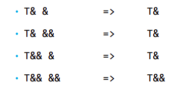

## Лекция 1. Шаблоны

#### проблематика:
C++ - язык статической типизации. Один и тот-же код может быть предназначен для разных типов данных, поэтому его приходится дублировать.
```
void sortArray(double* array, std::size_t size);

void sortArray(int* array, std::size_t size);
```

#### Шаблоны в с++ решают эту проблему.
- шаблоны основаны на параметрическом полиморфизме, который реализуется во время компиляции.

- компилятор создает (инстанцирует) столько реализаций шаблона, сколько различных вызовов шаблона было в коде.

- весь код шаблона класса пишется в .h-файле, чтобы не возникло проблем с инстанцированием. 
(хотя явное инстанцирование позволяет писать 
определение функций шаблона в .cpp-файле)

#### виды шаблонов
- function template
- class template
- alias template (с++ 11)
- variable template (c++ 14)
- concepts (c++ 20)

#### шаблоны функций 
```
template <class T>
void sortArray(T* array, size_t size) {
    ...
}
```
Если при вызове функции-шаблона не указать тип явно, он будет выведен автоматически. Но приведения типов не происходит
```
template <class T>
void foo(T param1, T param2) { ... }

int i = 1;
double d = 2.0;
foo(i, i); //T is int
foo(d, d); //T is double
foo(i, d); //compile error
```
при инстанцировании шаблона const и ссылки отбрасываются.
Указатели (в том числе константные) не отбрасываются 
```
template<class T>
void foo(T a) { ... }

int i = 0;
const int ci = 0;
int& ri = i;
const int& cri = i;

int* pi = &i;
const int* cpi = &i;

foo(i); //T - int
foo(ci); //T - int
foo(ri); //T - int
foo(cri); //T - int
foo(pi); //T - int*
foo(cpi); //T - const int*
```
Если коротко, при передаче аргумента-generic по ссылке или указателю - const сохраняется.

#### порядок применения функций
Если есть несколько реализаций однойи той же функции - какую вызвать?
1. нешаблонная функция с совпадающими типами параметров

2. шаблонная функция 

3. нешаблонная функция, где возможно неявное приведение типов
```
void foo(int a, int b) { ... }

template<class T>
void foo(T a, T b) { ... }

foo(5, 5); //non-template fun

foo(3.0, 3.0); //template

foo(5, 3.0); //non-template fun
```

#### reference collapsing (c++ 11)
если внутри шаблона создается ссылка на тип Т, но сам этот тип - ссылочный?



#### задача, ведущая к пониманию std::forward
нужно написать функцию-wrapper для функции foo.
Неудачные решения:
```
// не подойдёт, если foo меняет аргументы по ссылке
template <class T1, class T2>
void wrapper(T1 a1, T2 a2) { foo(a1, a2); }

// не подойдёт для аргументов R-value
template <class T1, class T2>
void wrapper(T1 &a1, T2 &a2) { foo(a1, a2); }

// не подойдёт, если foo меняет аргументы по ссылке
template <class T1, class T2>
void wrapper(const T1 &a1, const T2 &a2) { foo(a1, a2); }
```
std::forward<>() - нужна для передачи параметров, полученных по универсальным ссылкам. Эта функция позволяет по возможности выполнять перемещение вместо копирования
Решение:
```
template <class T1, class T2>
void wrapper(T1 &&a1, T2 &&a2) {
 foo(std::forward<T1>(a1), std::forward<T2>(a2));
}
```

#### шаблоны классов
При создании объекта шаблона-класса нужно явно указать параметры шаблона.

Неявное инстанцирование - компилятор сам создаст нужные реализации шаблона.

Явное инстанцирование - мы можем в коде инстанцировать шаблон, чтобы не генерировать его автоматически в каждой единице трансляции:
```
template<class T>
class Stack { ... };

template class Stack<int>;
```

#### специализация шаблонов
Для конкретных параметров шаблона можно написать специальную версию класса или функции.

template<class T>
class Stack { ... };

template <>
class Stack<bool> { ... }

#### параметры шаблона по умолчанию 
Например, vector по умолчанию в качестве аллокатора использует аллокатор стандартной библиотеки:
```
template<class T, class Allocator = std::allocator<T>>
class Vector { ... };
```
### non-type template parameters
Параметры шаблона могут быть конкретными значениями.
Вот как реализована под капотом std::size, которая вернет длину массива:
```
template<class T, std::size_t N>
size_t size(const T(&)[N]) {
    return N;
}
```
### шаблон - параметр шаблона
это возможно. Но для совместимости с С++17 и раньше нужно использовать class вместо typename
### vararg-шаблоны
У шаблона может быть переменное число параметров:
```
template<class First, class... Other>
auto sum(First first, Other... other) {
    return first + sum(other...);
}
```
#### Неявный интерфейс шаблона 
это требования к параметрам шаблона, которые исходят из фактически написанного кода и проверяются при компиляции. 
То есть если в функции-шаблоне мы суммируем T - значит считается, что параметр Т поддерживает сложение и тд...