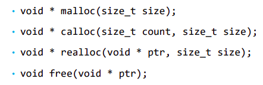
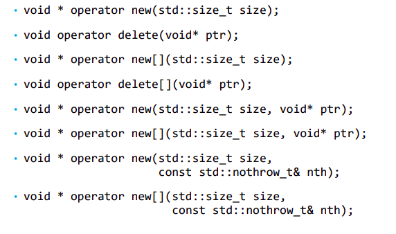
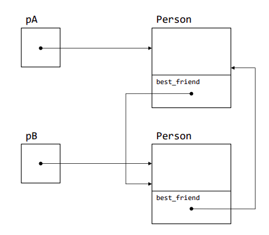

### Лекция 2. Память в с++
#### storage classes
в с++ есть 4 вида памяти (storage classes):
- static
- auto
- dynamic
- thread

#### динамическая память с-style (heap)
Для динамической памяти в стиле С есть функции malloc/free

(Здесь size - в байтах)
(указатель void* - аналог Any)
- malloc - выделит блок указанного размера
- calloc - выделит блоки для массива и инициализирует нулями
- realloc - изменяет размер уже выделенного блока памяти. Например, может расширить память для уже созданного массива.

Если память выделить не удалось, malloc и ему подобные вернут nullptr.

#### динамическая память с++ (free-store)
- используются new, delete, new[], delete[]
- они вызывают конструкторы или деструкторы объектов
- если new не выделит память, он выкинет std::bad_alloc

#### std::nothrow позволяет выдавать nullptr вместо std::bad_alloc в new:
```
#include <new>

int* array = new(std::nothrow) int[100];
```
#### Placement new
размещает объект в уже выделенной заранее памяти.
При этом оператор delete применять нельзя - нужно вызывать деструктор вручную.
```
char buff[sizeof(Person)];
Person* person = new(buff) Person(...);

...

person->~Person();
```
#### проблемы динамической памяти
- утечки памяти. Нужно вручную освобождать всю выделенную память.
- Висячие указатели - указатели, по которым не распологается объект. Поэтому указатели после применения delete нужно делать nullptr.
- фрагментация памяти от частой аллокации.

#### перегрузка new и delete
перегруженные операторы отвечают только за выделение/очищение памяти. Конструкторы и деструкторы вызываются вне перегруженных операторов.

Популярные варианты перегрузки:


#### Гарантии безопасности исключений
- гарантия отсутствия исключений. Исключения не выбрасываются вообще.

- базовая гарантия. Если выбросится исключение, то ресурсы корректно освобождаются, а объекты пригодны для использования. Но состояние объектов после исключения может измениться.

- строгая гарантия. После исключения состояние программы не меняется совсем. (copy-and-swap)

#### std::move()
преобразует объект к R-value. Эта функция позволяет вызвать конструктор перемещения или оператор перемещающего присваивания, даже если аргумент не r-value.

#### Правило пяти
Если определен хоть один, надо определить остальные:
- copy constructor
- move constructor
- copy assignment operator
- move assignment operator
- destructor
 
 #### RVO и NRVO 
оптимизации компилятора, чтобы не создавать объекты при возврате из функции.

#### идиома RAII
RAII (resource acquisition is initialization)
Захват ресурса происходит при создании объекта, а освобождение - при уничтожении.

Ресурсами могут быть:
- динамическая память
- файловые дескрипторы
- потоки ввода-вывода
- сетевые подключения 

### умные указатели
- ведет себя как обычный указатель, но освобождается автоматически
- работает по идиоме RAII
#### виды умных указателей
- auto_ptr - устарел
- unique_ptr - передача владения происходит только при перемещении, копирование запрещено.
- shared_ptr - разделяемое владение. Уничтожение объекта происходит с уничтожением последнего shared_ptr на него.
- weak_ptr - не владеет объектом, нужен для решения проблемы циклической зависимости. Не увеличивает счетчик ссылок.
#### подробно о unique_ptr
- может быть создан через функцию std::make_unique, позволяющая создать этот умный указатель.
- его копирование запрещено. Его можно только переместить (через std::move), передав владение другому unique_ptr.

#### подробно о shared_ptr
- допускает и копирование, и перемещение.
- память очищается, когда счетчик доходит до нуля.
- из-за него возникает проблема циклических ссылок
#### проблема циклических ссылок shared_ptr
```
struct Person {
    std::shared_ptr<Person> bestFriend;
};

...
{
    std::shared_ptr<Person> pA = std::make_shared<Person>();
    std::shared_ptr<Person> pB = std::make_shared<Person>();

    pA->bestFriend = pB;
    pB->bestFriend = pA;
}

//и здесь сами указатели уничтожатся, но объекты внутри них нет.
```


#### weak_ptr - решение циклических ссылок
- weak_ptr не является владельцем объекта.
- объект внутри weak_ptr доступен только через shared_ptr, который можно создать методом lock()
- метод expired() позволяет проверить, был ли объект внутри уже удален.
- нужен чисто для решения проблемы циклических ссылок.
#### Правило Ноля
Антагонист к правилу пяти. 
Вместо создания специальных методов класса (конструкторы копирования и тд), нужно полагаться на компилятор, который создает их по умолчанию. А для решения проблем применять RAII и умные указатели, например. (а лучше уйти на Rust)