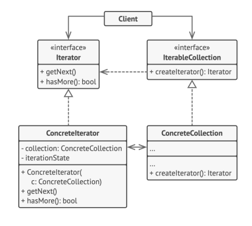

## Лекция 4. Итераторы с++
#### паттерн проектирования итератор
Итератор - поведенческий паттерн проектирования.

Есть коллекция, по которой можно итерироваться. У нее есть метод для создания итератора под нее.

В итераторе есть методы getNext() и hasMore()


#### пример использования итератора
напишем функцию, проверяющую отсортированность массива по неубыванию:
```c++
template<class T>
bool isOrdered(const T* array, size_t size) {
    for (int i = 0; i < size-1; ++i) {
        if (array[i] > array[i+1]) {
            return false;
        }
    }
    return true;
}
```
#### c++ гарантирует наличие корректного указателя за последним элементом массива. Но разыменовывать его нельзя!
Используем эту фичу и перепишем код, используя адресную арифметику:
```c++
template<class T>
bool isOrdered(const T* begin, const T* end) {
    while (begin != end) {
        const T* prev = begin;
        ++begin;
        if ((begin != end) && (*prev > *begin)) {
            return false;
        }
    }
    return true;
}
```
#### P.S константный указатель можно инкрементировать, но ему нельзя присвоить другое значение. (плюсисты - оккультисты слова const)

---
далее лекция неэффективна, идет конспект этой статьи Хабра:
https://habr.com/ru/companies/otus/articles/762548/
### Хабр. указатели и итераторы
#### указатели 
указатель - тип переменной, способный хранить адрес памяти.

У указателя может быть 3 состояния:
- указывает на nullptr
- указывает на переменную в памяти
- висячий указатель (dangling pointer) - это либо указатель после применения delete, либо указатель на объект в автоматической/статической памяти

#### указатели после удаления нужно занулять
Если применить к указателю delete дважды, будет undefined behaviour. Поэтому нельзя допускать наличие висячих указателей - их надо делать nullptr.
#### висячие указатели (dangling pointers)
Есть 3 случая появления висячих указателей:
- после применения delete
- указатель на статическую/автоматическую память
- если было несколько указателей на 1 объект. Тогда применение delete к одному делает остальные указатели висячими.

#### из чего состоит stl
stl можно разбить на 4 группы сущностей:
- алгоритмы (std::rotate, std::find_if ...)
- контейнеры (std::vector, std::list ...)
- функциональные объекты (std::greater, std::logical_and ...)
- итераторы (std::iterator, std::back_inserter ...)
#### итераторы
итератор - концепция, обобщающая поведение указателя.

Итераторы нельзя использовать с массивами в стиле С.
-----------
### виды итераторов
#### итераторы ввода (input iterators)
поддерживают операцию чтения, двигаются только вперед. Их можно инкрементировать.

Пример: итератор std::list
#### итераторы вывода (output iterators)
используются для присвоения значений в контейнере (записи). Двигаются только вперед.

Пример: std::back_inserter

#### однонаправленные итераторы (forward iterators)
комбинация итераторов ввода и вывода. Могут получать значения и изменять их. Двигаются только вперед. 

Пример: итератор для std::replace

#### двунаправленные итераторы (bidirectional iterators)
могут двигаться вперед и назад (инкремент и декремент). Могут получать значения и изменять их. 

Пример: итератор для std::reverse_copy

#### итераторы произвольного доступа (random access iterators)
могут двигаться на любое число позиций вперед и назад (операции + и -). Могут получать значения и изменять их.

Пример: итератор для std::random_shuffle()

### Как использовать итератор
итератор можно получить из контейнера 2 способами:
- через методы контейнера, например vector.begin()
- через свободные функции, например std::begin()

Часто вместе с итераторами используют ключевое слово auto:
```c++
#include <iostream>
#include <vector>

int main() {
    std::vector<int> vec {1, 2, 3, 4, 5};

    for (auto it = vec.begin(); it != vec.end(); ++it) {
        std::cout << *it << " ";
    }
    return 0;
}
```
P.S. end() возвращает итератор, указывающий на следующую после последней ячейку памяти. Это та самая фича.

-------
### Хабр кончился. Продолжаем лекцию ТП
#### итераторы потоков
позволяют использовать потоки ввода-вывода как контейнеры. Параметризуются типом вводимых-выводимых значений
- std::istream_iterator<>
- std::ostream_iterator<>
```c++
std::vector<int> vec {1, 2, 3};

std::ostream_iterator<int> cout_iterator(std::cout, ", ");

for (auto i = vec.begin(); i != vec.end(); ++i) {
    *out = *i
}
// 1, 2, 3, 
```
Здесь использованы 2 итератора: итератор вектора и итератор потока вывода. 

Причем итератор потока вывода не нужно инкрементировать, он инкрементируется автоматом, когда мы в него что-то суем.
#### итераторы вставки
параметризуются типом контейнера
- std::insert_iterator - вставка в произвольное место. Метод inserter()
- std::front_insert_iterator - вставка в начало. Метод front_inserter()
- std::back_insert_iterator - вставка в конец. Метод back_inserter()
```c++
std::vector<int> vec{1, 2, 3};

std::ifstream in("file.txt");

std::istream_iterator<int> beg(in);
std::istream_iterator<int> end;

auto ins_iterator = std::back_inserter(vec);

while(beg != end) { 
    *ins_iterator = *beg;
    ++beg;
    ++ins;
}
//vec = {1, 2, 3, 4, 5, 6}
```
#### константные итераторы
через них нельзя изменить элемент контейнера. 
Сам итератор менять при этом можно.

cbegin() и cend() - для константных итераторов.
```c++
std::vector<int> vec{1, 2, 3};

for (auto it = vec.cbegin(); it != vec.cend(); ++it) {
    std::cout << *it << " ";
    
}
//но если сделать *it = 0 будет ошибка компиляции
```
#### инвалидация итераторов
Некоторые функции, модифицирующие контейнер, могут поломать итератор этого контейнера. 
```c++
std::vector<int> vec{1, 2, 3, 4, 5};
auto it = vec.begin();
++it;
vec.erase(it); //удаляем элемент 2
++it; //undefined behaviour
```
В доках есть список инвалидирующих методов.

### Разыменовывание и инкремт
```c++
*p++;
```
Кстати здесь работает так:
разыменовываем указатель, возвращаем значение под ним, а потом уже сам указатель инкрементируем. А не наоборот.
