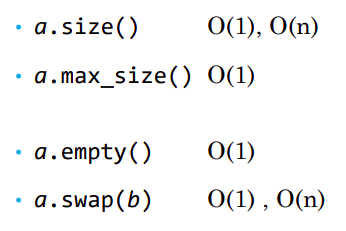

### Лекция 5. Последовательные контейнеры
Контейнеры в STL делятся на ассоциативные и последовательные
- Sequence container - поддерживают порядок элементов
- Associative container - сами определяют порядок элементов или не гарантируют его вовсе

### Требования к элементам контейнера (С++13)
- конструктор по умолчанию
- конструктор копирования
- оператор копирующего присваивания
- деструктор
- оператор сравнения ==

### псевдонимы типов контейнеров
Здесь С - тип контейнера
- C::value_type - тип элемента
- С::reference - ссылка на элемент
- C::const_reference - константная ссылка на элемент
- C::iterator 
- C::const_iterator
- C::difference_type - (см. iterator_traits)
- C::size_type - тип, достаточный для представления любого положительного difference_type

### подробно о begin и end
- Итераторы end() и cend() разыменовывать нельзя, так как они указывают на первую после массива ячейку памяти.

- Если контейнер пуст, то begin() = end()

- еще есть функции std::begin(), std::end() - они вызовут аналогичные методы контейнера или работают с обычным массивом.

### Сложность операций с контейнерами


Причем для оператора == контейнеры сравниваются поэлементно. Поэтому элменты должны реализовывать оператор ==.

swap() для массива будет O(n). Для списка - O(1)

### std::vector<>
- Это аналог ArrayList
- Элементы в памяти идут друг за другом
- Вставка за О(1) только в конец
- есть итераторы произвольного доступа
- вместо [] можно использовать at(), чтобы выбросить исключение в случае неправильного индекса.
### емкость std::vector<>
Память внутри vector выделяется с запасом.
- size() - число элементов
- capacity() - емкость элементов
- reserve() - выделить память с запасом для новых возможных элементов
- shrink_to_fit() - уменьшить емкость до текущего количества элементов.
### специализация std::vector<bool>
Экономит память в 8 раз - хранит bool-элементы в битах. Но взять адрес отдельного элемента нельзя.

### std::array<>
- аналог массива фиксированного размера
- Элементы в памяти идут друг за другом
- итераторы произвольного доступа
- хранит информацию о своем размере
- не превращается в указатель при передаче в функцию, в отличие от простого массива

### std::list<>
- двусвязный LinkedList
- нет оператора []
- вставка в любое место за О(1)
- двунаправленные итераторы
- распологается в произвольных местах памяти кусками. Из-за этого не использует кэш процессора эффективно.

### std::forward_list<>
- односвязный LinkedList
- нет оператора []
- вставка в любое место за О(1)
- однонаправленные итераторы
- распологается в произвольных местах памяти кусками. Из-за этого не использует кэш процессора эффективно.

### std::dequeue<>
- двусторонняя очередь
- есть оператор []
- вставка за О(1) в конец или начало
- итераторы произвольного доступа
- элементы хранятся чанками (группами) в разных местах памяти

### реверсивные итераторы
Методы rbegin() и rend() вернут реверсивные итераторы.

У реверсивного итератора есть метод base(), чтобы получить обычный итератор.

### Адаптеры
Адаптеры - набор АПИ, ограничивающих функционал стандартных или кастомных контейнеров в понятной форме.
- std::stack<>
- std::queue<>
- std::priority_queue<>

То есть для них можно указать, на базе какого контейнера они будут работать:
```c++
std::stack<int, std::vector<int>> s;

s.push(10);
s.push(20);
s.push(30);

std::cout << s.top() << "\n"; //30
s.pop();
```